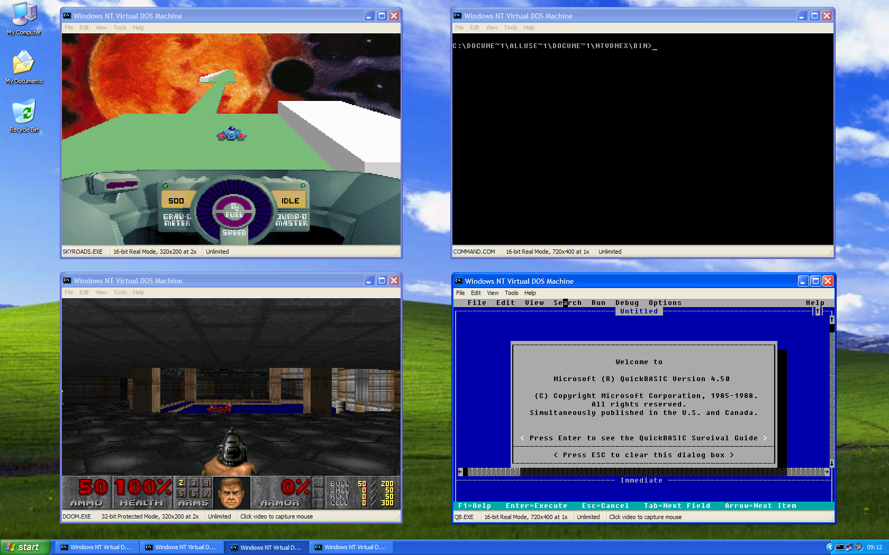
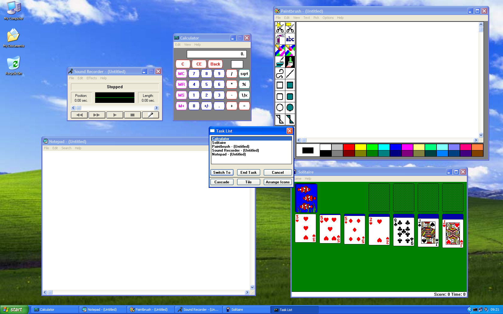

# NTVDMEX

**A replacement for `ntvdm.exe` on Windows XP SP3 (32-bit).** It runs MS-DOS and Windows 3.x
programs on the real CPU, in the processor's Virtual-8086 mode, rather than in a software
emulator, and puts each one in its own window on the XP desktop.

## What it is

When Windows XP starts a 16-bit program it hands it to a support process, the NT Virtual
DOS Machine (`ntvdm.exe`). NTVDMEX is a from-scratch implementation of that process. Like
the original, it lets the real processor run the program's code and traps what the program
asks of the machine: DOS and BIOS services, video, sound, input, timers. Those are
re-implemented here.

It is not an emulator and not a fork: it reuses the NT kernel's own VDM support, so 16-bit
code runs at the speed of the machine. DOS extenders work too: 32-bit protected-mode games
such as Doom run through the DPMI host NTVDMEX provides.

## What runs

- **DOS games and programs**: Doom and other DOS/4GW titles, Skyroads, QuickBASIC, MS-DOS's
  own `COMMAND.COM`, with VGA and VESA graphics, Sound Blaster, OPL (AdLib) music, MIDI and
  the mouse.
- **Windows 3.x programs**: Notepad, Paintbrush, Calculator, Solitaire, Sound Recorder, the
  Task List and others, as real windows on the XP desktop.
- Windowed or fullscreen, several programs at once, each in its own window.

## Status

NTVDMEX is under active development and has not had a first release yet. The programs
above have been tested on the maintainer's XP machines; plenty of others will not work yet.
Known gaps and planned work are in the [issue tracker](https://github.com/MrMatthewLayton/ntvdmex/issues).

- **Windows XP SP3, 32-bit only.** Virtual-8086 mode does not exist in 64-bit Windows, so
  there will be no 64-bit version.
- **It replaces `ntvdm.exe` for the whole machine** while installed. Installing and
  uninstalling are a single registry value; stock NTVDM is never modified.

## Quick start

1. **Build** on macOS or Linux (it cross-compiles to XP):
   `brew install mingw-w64 cmake nasm`, then `./scripts/build.sh`.
2. **Package**: `./scripts/package.sh` writes `dist/ntvdmex-<date>-<sha>.zip`.
3. **Copy** the zip to the XP machine and extract it anywhere.
4. **Install**: run `install.bat` as an administrator. `status.bat` says what now runs DOS
   programs; `uninstall.bat` gives them back to stock NTVDM.
5. **Run** any DOS or Windows 3.x program the way you normally would, or open
   `bin\ntvdmhost.exe` for a DOS prompt.

[docs/quick-start.md](docs/quick-start.md) covers the keyboard shortcuts, the mouse, copy and
paste, and what to do when something goes wrong.

## Documentation

- [Quick start](docs/quick-start.md): installing, running, shortcuts.
- [Building](docs/building.md): the toolchain, the build, the off-machine test battery.
- [Architecture](docs/architecture.md): how NTVDMEX is put together.
- [The documentation index](docs/README.md): design decisions, the hardware references, the
  inventories of what is implemented, the code style and the roadmap.

## Contributing

Contributions are welcome: start with [CONTRIBUTING.md](CONTRIBUTING.md). Every change goes
through a pull request, and CI builds it, runs the test battery and checks the style. Please
read [CLEAN-ROOM.md](CLEAN-ROOM.md) (what may and may not enter the repository) first, and
report a security problem as [SECURITY.md](SECURITY.md) describes.

## License

[MIT](LICENSE) © 2026 Matthew Layton.
